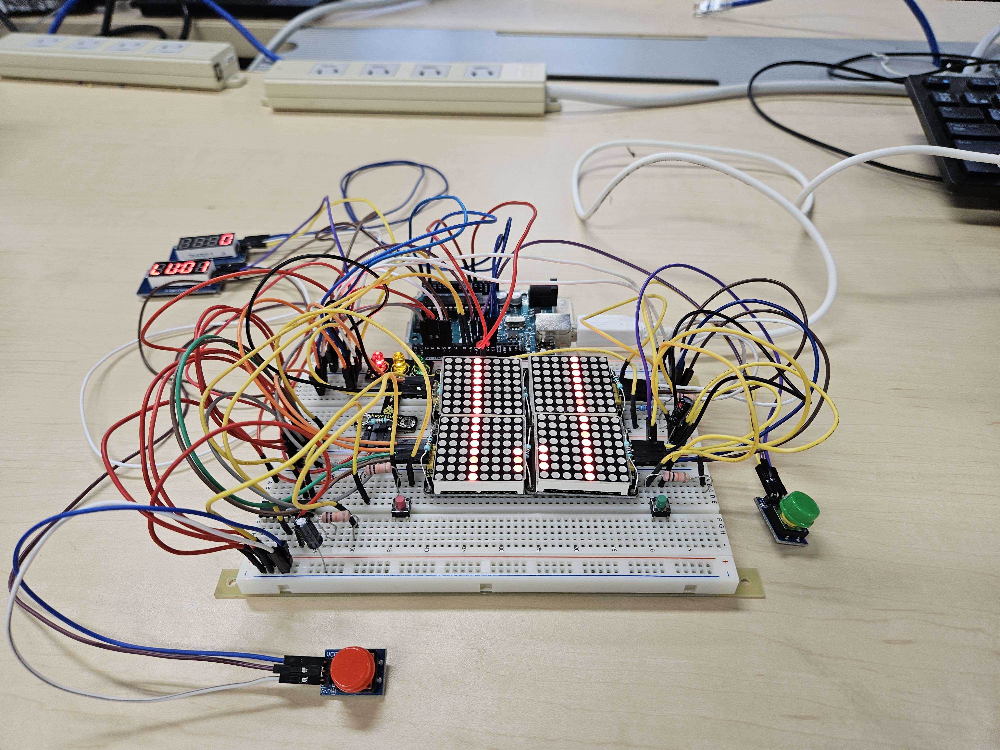
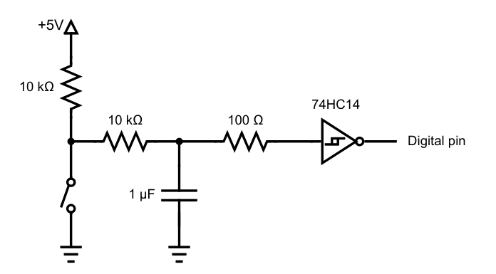

# Ardiuno Race Game

This is a simple game that I made for Arduino. The game need you to control the car
to avoid hitting the wall. Your target is to get the highest score. The game will
end when you hit the wall or the score reach 9999.

## Hardware you need

- Arduino Uno
- 8x8 LED Matrix \* 4 (The one can change I2C address)
- 4 Digit Display \* 2 (One for score, one for game level)
- Button \* 4 (I use 2 normal buttons and 2 buttons in 48 sensor package) (Two for Speed up and Speed down, two for control the car)
- a traffic light LED
- Several wires
- A breadboard

### Notice

If you are using a normal button, you can follow this picture to avoid chattering.

  <em>柗本真佑，小南大智. 2024年度 情報科学実験B指導書. p16</em>

The way to connect the four 8x8 LED Matrix is shown below.
| left | right |
| ---- | ----- |
| 0x70 | 0x71 (180 degree rotation) |
| 0x72 | 0x74 (180 degree rotation) |

If you don't know how to use the 4 digit display, you can refer to the [Interfacing TM1637 4-Digit 7-Segment Display with Arduino](https://lastminuteengineers.com/tm1637-arduino-tutorial/) to know how to use it.

If you don't know how to use the keyestudio 48 sensor package, you can refer to the [keyestudio 48 in 1 Sensor Kit For Arduino](https://docs.keyestudio.com/projects/KS0522/en/latest/) to know how to use it.

## How to play

When the large button is pressed to start the game, the signal light LED in the upper left corner will light up in sequence: red, yellow, and green. After all the lights turn off, the game will begin. If the large green button is pressed before the signal lights turn off, it will be considered a foul, resulting in an immediate loss. The car must be moved left and right to avoid crashing into the walls. Crashing into a wall results in an immediate loss. Achieving a score of 9999 results in a victory. You can press the two big buttons to change the game level. The higher the game level, the faster the game speed. You can always upgrade the level before game level is 20. But you can't downgrade the level lower than the minimum level of the current score.

## Formula

### Score

The score will be calculated by the following formula.

$$ Score = Score + GameLevel \times (RoadLevel + 1) $$

### Game Level

Game level can be changed by the two big buttons. The game level will be calculated by the following formula.

$$ GameLevel = max(1, min(20, 1 + Score/500)) $$

### Road Level

Each upgrade of the road level will decrease the width of the road by 1. The road level will be calculated by the following formula.

| Score       | RoadLevel |
| ----------- | --------- |
| 0 ~ 999     | 0         |
| 1000 ~ 2999 | 1         |
| 3000 ~ 4999 | 2         |
| 5000 ~ 6999 | 3         |
| 7000 ~ 9999 | 4         |

### Speed

Speed means the time interval between two frames. The speed will be calculated by the following formula.

$$ Speed(ms) = 1000(ms) / GameLevel $$
